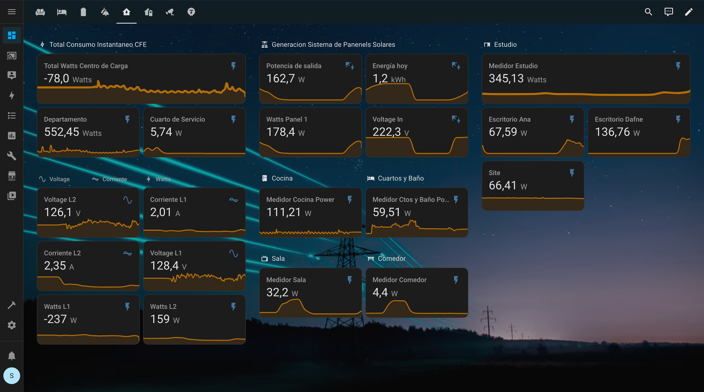

# 📡 Tuya Smart Meter Integration with Home Assistant via AppDaemon

This project allows you to extract real-time power data (voltage, current, active power, energy consumption) from Tuya-compatible smart meters (like the TOMZN DDS238-1-W1) using the Tuya Cloud API, and expose them as sensors in Home Assistant using **AppDaemon**.



---

## 🔧 Requirements

* Tuya-compatible smart meter (e.g., TOMZN DDS238-1-W1)
* A Tuya Cloud developer account: [https://iot.tuya.com](https://iot.tuya.com)
* Your device must be registered and online in the Tuya platform
* Home Assistant with AppDaemon addon installed

---

## 🗂️ File Structure

```
/config
└── appdaemon
    ├── apps
    │   ├── medidor_centro_carga.py  ← Main logic for decoding and sensors
    │   └── apps.yaml                 ← Configuration for devices
    └── appdaemon.yaml                ← AppDaemon config
```

---

## 🔐 Configuration

### `apps.yaml`

```yaml
tuya_medidor_l1:
  module: medidor_centro_carga
  class: TuyaMedidor
  access_id: your_tuya_access_id
  access_key: your_tuya_secret_key
  device_id: eb244fcdfc27bae2181xyj
  nombre: centro_carga_l1

tuya_medidor_l2:
  module: medidor_centro_carga
  class: TuyaMedidor
  access_id: your_tuya_access_id
  access_key: your_tuya_secret_key
  device_id: eb0b07db3da85b990bvxqh
  nombre: centro_carga_l2
```

---

## 📊 Created Entities

Each `device_id` creates the following sensors in Home Assistant:

```
sensor.centro_carga_l1_voltage
sensor.centro_carga_l1_current
sensor.centro_carga_l1_active_power
sensor.centro_carga_l1_reactive_power
sensor.centro_carga_l1_total_power
sensor.centro_carga_l1_total_forward_energy
sensor.centro_carga_l1_backward_energy
sensor.centro_carga_l1_total_energy
```

Each with appropriate units and device classes (e.g., `power`, `energy`, `voltage`, etc.).

To be compatible with the **Energy dashboard**, energy-type sensors also define:

```yaml
state_class: total_increasing
last_reset: none
```

---

## 🔍 `phase_a` Byte Mapping (Detailed Explanation)

The `phase_a` field is Base64-encoded binary data that includes multiple electrical measurements. The decoded data can be parsed as follows:

| Bytes (Offset) | Value        | Transformation | Unit  |
| -------------- | ------------ | -------------- | ----- |
| 2–3            | Active Power | `raw`          | Watts |
| 11–12          | Current      | `× 0.001`      | Amps  |
| 13–14          | Voltage      | `× 0.1`        | Volts |

🧠 Example Python decoder:

```python
decoded = base64.b64decode(phase_a)
active_power = int.from_bytes(decoded[2:4], 'big')
current = round(int.from_bytes(decoded[11:13], 'big') * 0.001, 3)
voltage = round(int.from_bytes(decoded[13:15], 'big') * 0.1, 1)
```

---

## ⚙️ Advanced Notes

* Tuya Cloud requires time-synced systems. If you get error 1013 (`request time is invalid`), ensure NTP is working.
* This setup does not require `tuya_v2` or Tuya Local integration.
* AppDaemon runs outside the Home Assistant YAML domain, so sensors are dynamic.

---

## 🧪 Tested Devices

| Brand | Model       | Notes                 |
| ----- | ----------- | --------------------- |
| TOMZN | DDS238-1-W1 | Works bidirectionally |

---

## 🤝 Contributions

This project is open and extendable. Feel free to fork, enhance, and contribute new decoder formats or improvements!

---

## 🛡️ License

MIT License.
